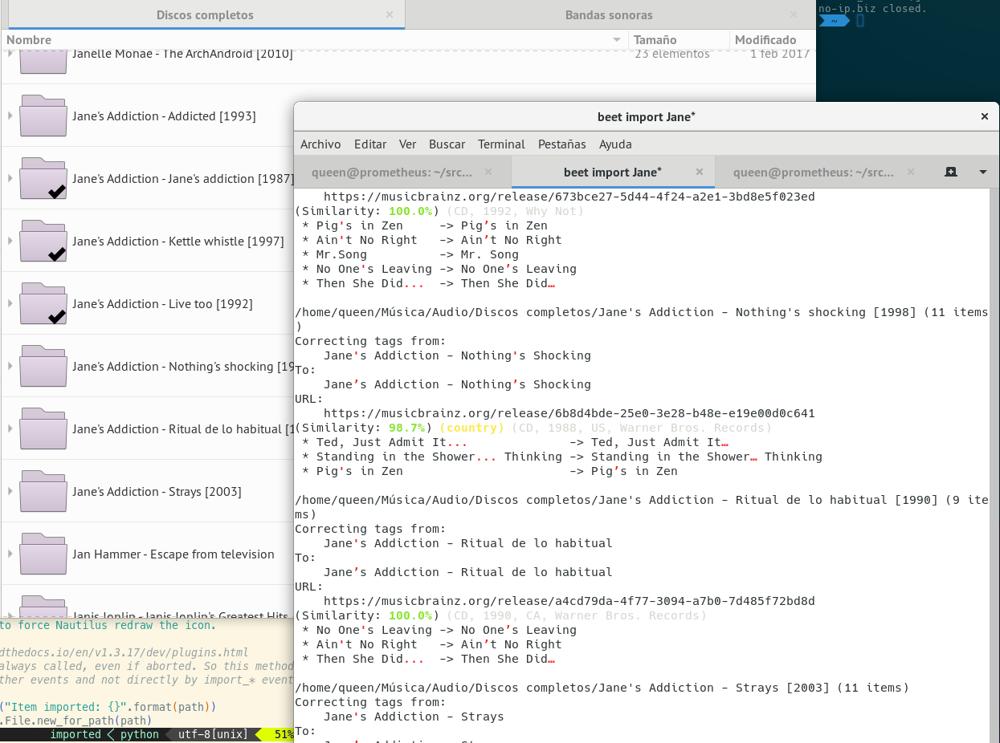

NautilusEmblem
==============

## A [Beets](http://beets.io) plugin for happy gnome users.

Reorganizing your music again? Want to know what directories are currently
imported after your loooong importing sessions? You are in the right place.

NautilusEmblem will add an «OK» emblem to directories after every album is
imported succesfully to Beets. If `Skip` or `aBort`, emblem is not added.

In case of reimporting previously added albums, it will show the emblem too if 
not already.

> Disclaimer: Only tested in `copy: no` mode

(ↄ) 2018 - [qinn.es](http://qinn.es)
